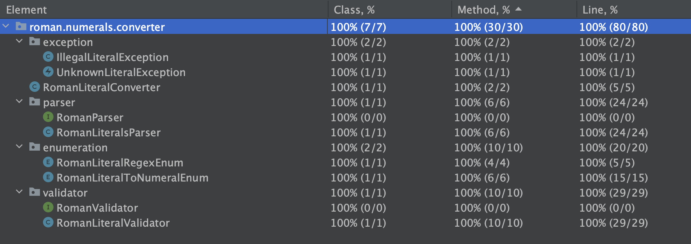

# Roman Numerals Kata

### Problem

---

[Rules for Formation of Roman-numerals](https://www.math-only-math.com/rules-for-formation-of-roman-numerals.html)

#### Goal

---
The goal is to implement an algorithm to parse a roman literals so as to find its representation on numeral notation.

#### Examples

---
Valid conversions


| Roman Literal | Numerals    |
|---------------|-------------|
| VII  	        | 7	          |
| XXXIV  	      | 34          |
| XXXVII  	     | 37	         |
| CXLV  	       | 145	        |
| CLIX  	       | 159	        |
| XLVIII  	     | 48	         |

---
Errors and exceptions

| Failure Conditions                                                     | Expected Output                                                  |
|------------------------------------------------------------------------|------------------------------------------------------------------|
| Blank value or null	                                  | An **IllegalLiteralException** is thrown with a specific message |
| Unknown literal	                                                       | An **UnknownLiteralException** is thrown with a specific message |
| Literals V or L or D can't be repeated more than once	                 | An **IllegalLiteralException** is thrown with a specific message |
| Literals I or X or C can't be repeated in succession more than thrice  	 | An **IllegalLiteralException** is thrown with a specific message |


### Environment Build

This project has been compiled with Java 14.

### How To

- Compile with maven

    ```
    $> cd $PATH_TO_LOCAL_REPOSITORY/roman-numerals-kata
  
    $> mvn clean install
    ```

- Launch tests with maven

    ```
    $> cd $PATH_TO_LOCAL_REPOSITORY/roman-numerals-kata
  
    $> mvn test
    ```

### Test Coverage

